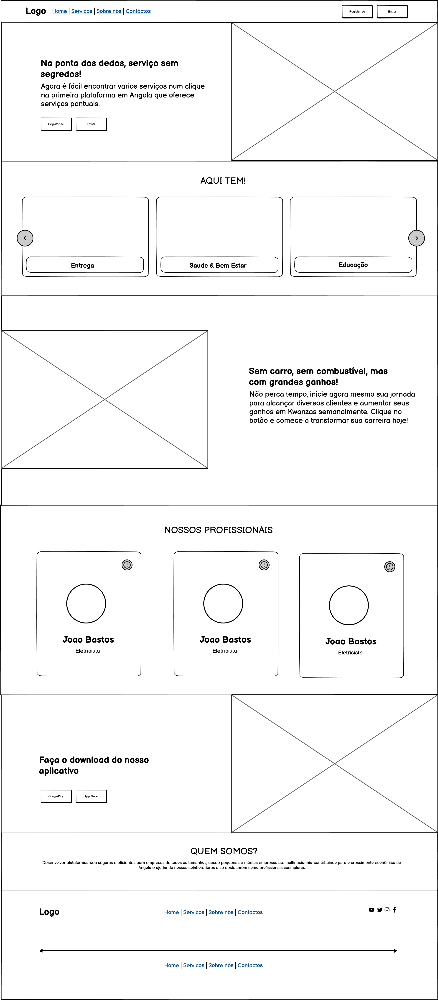

# Getting Started with Create React App

Aqui estão os links relevantes para o projeto:

- Repositório do Frontend: [GitHub](https://github.com/Catson28/NowFrontendReact)
- Repositório do Backend: [GitHub](https://github.com/Catson28/NowBackendDjango)
- Repositório do Build (Executável) do Frontend: [GitHub](https://github.com/Catson28/BuildedNowFrontendReact)
- Domínio Free do Executável: [JASoftware](https://jasoftware.netlify.app)
- API do Projeto: [PythonAnywhere](https://jasoftware.pythonanywhere.com/)

Estes links fornecem acesso aos diferentes aspectos do projeto, incluindo o código-fonte, o executável do frontend, o domínio onde o frontend pode ser visualizado em qualquer dispositivo e a API para integração com outros sistemas.

## Fontes de Inspiracao

[booking](https://www.booking.com/index.pt-pt.html?label=gen173nr-1BCAEoggI46AdIM1gEaAmIAQGYAR-4ARfIAQzYAQHoAQGIAgGoAgO4ApHd97EGwAIB0gIkOGVlODdkOGUtZGE4Mi00NDA2LWFlYTUtMDQxMDBlMjhkNDFj2AIF4AIB&sid=f9b1c18ada902250a1b8c240d6fd1a2d&keep_landing=1&sb_price_type=total&)


### `npm start`


Runs the app in the development mode.\
Open [http://localhost:3000](http://localhost:3000) to view it in the browser.

### `npm test`

### `npm run build`

Builds the app for production to the `build` folder.\
It correctly bundles React in production mode and optimizes the build for the best performance.

The build is minified and the filenames include the hashes.\
Your app is ready to be deployed!

See the section about [deployment](https://facebook.github.io/create-react-app/docs/deployment) for more information.

### `npm run eject`

**Note: this is a one-way operation. Once you `eject`, you can’t go back!**

If you aren’t satisfied with the build tool and configuration choices, you can `eject` at any time. This command will remove the single build dependency from your project.

Instead, it will copy all the configuration files and the transitive dependencies (webpack, Babel, ESLint, etc) right into your project so you have full control over them. All of the commands except `eject` will still work, but they will point to the copied scripts so you can tweak them. At this point you’re on your own.

You don’t have to ever use `eject`. The curated feature set is suitable for small and middle deployments, and you shouldn’t feel obligated to use this feature. However we understand that this tool wouldn’t be useful if you couldn’t customize it when you are ready for it.

## Learn More

You can learn more in the [Create React App documentation](https://facebook.github.io/create-react-app/docs/getting-started).

To learn React, check out the [React documentation](https://reactjs.org/).





texto original do GlobalStyles

```tsx
import { createGlobalStyle } from 'styled-components';
// import AristaProFont from './Arista-Pro/Arista-Pro-Bold-trial.ttf'; 

const GlobalStyles = createGlobalStyle`
  @font-face {
    font-family: 'Arista Pro';
    src: url(${AristaProFont}) format('truetype'); // Verifique se o formato corresponde ao arquivo da fonte
    font-weight: normal;
    font-style: normal;
    /* Outras propriedades conforme necessário, como font-display */
  }

  /* Estilos globais adicionais */
`;

export default GlobalStyles;

```

# Dependencias para o uso do facebook

```bash
npm install @types/facebook-js-sdk @vitejs/plugin-react jsdom rimraf rollup tsup vitest yarn-audit-fix --save-dev
npm install @semantic-release/git --save-dev
```

[Resolucao de bub](resolucao/bugs.md)
[Conprimento (Width) do container](resolucao/container.md)

# _

Para adicionar a variável de ambiente `PORT` ao seu projeto React TypeScript, você pode seguir os seguintes passos:

1. **Criar ou editar o arquivo `.env`:**
   - Na raiz do seu projeto, crie um arquivo chamado `.env` se ele ainda não existir.

2. **Adicionar a variável de ambiente:**
   - Abra o arquivo `.env` e adicione a seguinte linha para definir a porta como 8081:
     ```env
     PORT=8081
     ```

3. **Certificar-se de que o CRA (Create React App) está configurado para usar as variáveis do `.env`:**
   - Se você criou seu projeto com Create React App (CRA), ele automaticamente carrega as variáveis de ambiente do arquivo `.env`. 
   - As variáveis definidas no `.env` devem estar prefixadas com `REACT_APP_` para serem acessíveis no código do seu aplicativo, mas a variável `PORT` é uma exceção e pode ser usada sem o prefixo `REACT_APP_`.

4. **Reiniciar o servidor de desenvolvimento:**
   - Depois de adicionar ou modificar o arquivo `.env`, você precisa reiniciar o servidor de desenvolvimento para que as novas variáveis de ambiente sejam carregadas. 

Aqui está um exemplo de como o arquivo `.env` pode se parecer:

```env
PORT=8081
```

Com esses passos, seu aplicativo React TypeScript deve ser executado na porta 8081 quando você iniciar o servidor de desenvolvimento com `npm start` ou `yarn start`.